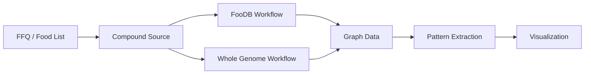
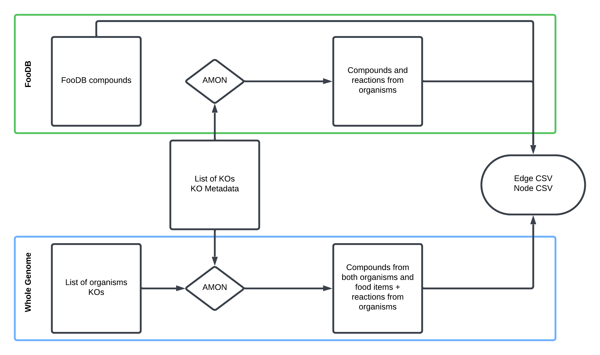

# Running the Pipeline

This pipeline converts dietary data (e.g., FFQs) and microbial gene information into a
graph structure for analyzing metabolic interactions between food and gut microbes.

---

## Overview



| Step | Description | Required |
|------|-------------|----------|
| 1 | Launch Streamlit app to create machine-readable FFQ | Optional |
| 2 | Choose compound source (FooDB or KEGG) | ✅ |
| 3A/3B | Generate nodes and edges | ✅ |
| 4 | Microbial compound report | Optional |
| 5 | Build graph and extract patterns | ✅ |
| 6 | Visualize results | Optional |

---

## Step 1 — Create a Machine-Readable FFQ

Food Frequency Questionnaires (FFQs) capture how often participants consume specific foods,
but they aren't directly usable in computational workflows due to format heterogeneity,
lack of molecular resolution, and inconsistent structure.

A Streamlit app is provided to generate standardized, machine-readable FFQ datasets that
map food items to compounds via **FooDB** or **KEGG**.

```bash
streamlit run src/get_foods.py
```

In the app:
1. Search for and select foods
2. Assign a consumption frequency (1–100%)
3. Download the generated dataset
4. Shut down the application

!!! tip "No FFQ? No problem."
    You can run the pipeline using all foods available in FooDB. Skip food metadata
    creation in Step 3A, or pass the `foodb` and `all-foods` flags in the workflow runner.
    Food compound reports are skipped due to dataset size.

---

## Step 2 — Choose a Compound Source

### Option A: FooDB (Experimental)

FooDB contains compounds identified in foods via LC-MS experiments, many of which link
to KEGG. Core metabolic compounds (amino acids, sugars, fatty acids, nucleotides) are
well-represented, but specialized plant compounds (flavonoids, alkaloids, terpenes) may
be missing.

**Limitations:** Incomplete compound coverage · Limited food representation · U.S.-centric food data

### Option B: KEGG Whole Genomes (Genome-Based Prediction)

Compounds are inferred from an organism's genome based on its metabolic capabilities
using KEGG organism data.

**Limitations:** Requires decomposing complex foods into components · Doesn't account for
ripeness or cooking · Predictions may not reflect actual composition



!!! note
    [AMON](https://github.com/lozuponelab/AMON) takes a list of KOs and finds producible
    compounds via KEGG reactions, assigning their origin (dietary vs. microbial).

---

## Step 3A — FooDB Workflow

### 1. Generate Food–Compound Metadata

> Skip this step if using all FooDB foods — `Data/AllFood/food_meta.csv` is pre-built.

```bash
Rscript src/Metabolome_proc/comp_FoodDB.R \
  --diet_file  "Data/test_sample/foodb_foods_dataframe.csv" \
  --content_file "Data/Content.csv" \
  --ExDes_file "Data/CompoundExternalDescriptor.csv" \
  --meta_o_file "food_meta.csv"
```

**Output:** Food items mapped to KEGG compound IDs with aggregated consumption frequencies.

### 2. Generate Food Compound Report *(optional)*

> Skip if using all foods — the dataset is too large.

```bash
python src/Metabolome_proc/RenderCompoundAnalysis.py \
  --food_file "food_meta.csv" \
  --output "food_compound_report.html"
```

### 3. Run AMON

```bash
amon.py \
  -i "Data/test_sample/noquote_ko.txt" \
  -o "AMON_output/" \
  --save_entries
```

### 4. Create Graph Data

```bash
python src/Metabolome_proc/main_metab.py \
  --f "food_meta.csv" \
  --r "AMON_output/rn_dict.json" \
  --m_meta "Data/test_sample/ko_taxonomy_abundance.csv" \
  --e-weights \
  --n-weights \
  --org \
  --a "Abundance_RPKs" \
  --o "graph/"
```

---

## Step 3B — Whole Genome Workflow

### 1. Map Organisms to KOs

```bash
python src/WholeGenome_proc/comp_KEGG.py \
  -i "Data/test_sample/kegg_organisms_dataframe.csv" \
  -k "org_KO/" \
  -o "food_item_kos.csv"
```

### 2. Run AMON

```bash
amon.py \
  -i "Data/test_sample/noquote_ag_sample.txt" \
  -o "AMON_output/" \
  --other_gene_set "org_KO/joined.txt" \
  --save_entries
```

### 3. Create Graph Data

```bash
python src/WholeGenome_proc/main_geno.py \
  --f_meta "food_item_kos.csv" \
  --m_meta "Data/test_sample/ko_taxonomy_abundance.csv" \
  --mapper "AMON_output/kegg_mapper.tsv" \
  --rn_json "AMON_output/rn_dict.json" \
  --e-weights \
  --n-weights \
  --org \
  --a "Abundance_RPKs" \
  --o "graph/"
```

### 4. Generate Food Compound Report

```bash
python src/WholeGenome_proc/RenderCompoundAnalysis.py \
  --node_file "graph/WG_nodes_df.csv" \
  --output "food_compound_report.html"
```

---

## Step 4 — Microbial Compound Report *(optional)*

Requires microbial taxonomy and abundance data.

```bash
python src/RenderCompoundAnalysis_Microbe.py \
  --node_file "graph/nodes.csv" \
  --edge_file "graph/edges.csv" \
  --output "microbe_compound_report.html"
```

---

## Step 5 — Build Graph and Extract Patterns

```bash
python src/run_graph.py \
  --n "graph/nodes.csv" \
  --e "graph/edges.csv" \
  --o "graph_results.csv"
```

**Patterns identified:**

| Pattern | Description |
|---------|-------------|
| Food → Microbe | Compound produced by diet, consumed by microbe |
| Food → Both | Compound shared between diet and microbial production |
| Both → Both | Compound produced and consumed across both sources |

---

## Step 6 — Visualize Graph Results

```bash
python src/RenderGraphResults_Report.py \
  --patterns "graph_results.csv" \
  --rxn_json "AMON_output/rn_dict.json" \
  --output "graph_results_report.html"
```

!!! note
    Steps 2–4 correspond to the general workflow described on the [home page](index.md).

!!! tip
    Use `run_workflow.py` to run Steps 3–4 automatically. See the
    [Quick Start guide](quickstart.md) for a complete example.